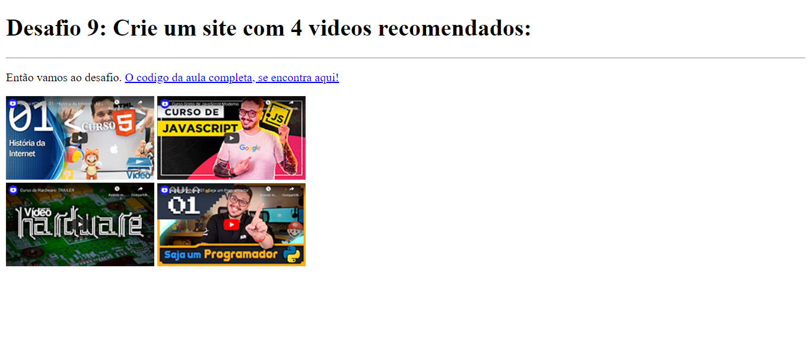
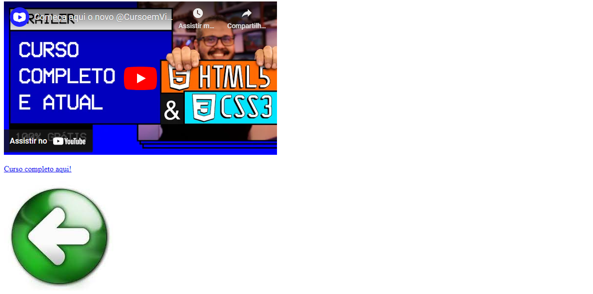
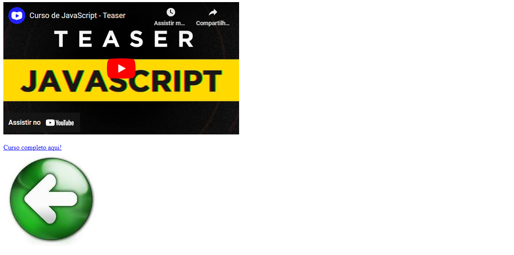
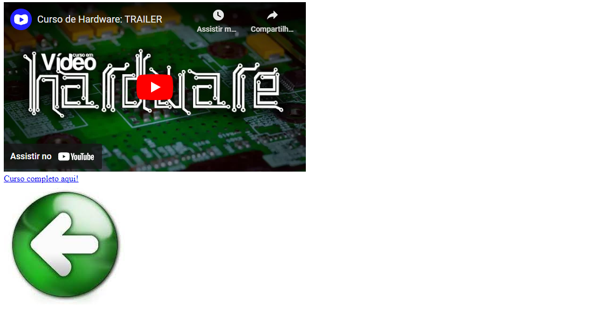

# VIDEOS EM IFRAME
👨‍🏫PROJETO FEITO PARA O CURSO DE HTML E CSS DO CURSO EM VIDEO.

 <br><br>
 <br><br>
 <br><br>
 <br><br>
 <br>

## DESCRIÇÃO:
Este aplicativo apresenta uma página da web com recomendações de cursos em vídeo sobre diferentes tópicos. Aqui está o que você pode fazer e como usar o aplicativo:

1. **Vídeos Recomendados:** O aplicativo exibe miniaturas de quatro vídeos recomendados, cada um relacionado a um curso específico.
2. **Links para os Cursos:** Para cada miniatura, há um link que direciona para o primeiro vídeo do curso completo correspondente.
3. **Navegação Simples:** Os links para os cursos completos estão disponíveis para fácil acesso.

## COMO USAR?
### BAIXANDO O PROJETO:
* Clone o repositório para o seu sistema local:

```bash
git clone https://github.com/VILHALVA/VIDEOS-EM-IFRAME.git
```

* Navegue até o diretório do projeto.

```bash
cd VIDEOS-EM-IFRAME
```

* Descompacte o arquivo ZIP (se você baixou manualmente):

```bash
unzip VIDEOS-EM-IFRAME.zip
```

* Abra o arquivo `CODIGO.html` em um navegador da web.

### EXECUTANDO O PROJETO:
1. **Visualização dos Vídeos Recomendados:** Ao abrir a página, você verá as miniaturas dos vídeos recomendados.
2. **Assistir aos Vídeos Recomendados:** Clique em qualquer miniatura para assistir ao vídeo recomendado correspondente.
3. **Acessar o Curso Completo:** Se desejar explorar mais sobre o assunto, clique no link fornecido abaixo de cada miniatura para acessar o curso completo correspondente.
4. **Navegação entre Páginas:** Se desejar voltar à página principal após assistir aos vídeos ou acessar os cursos completos, você pode clicar no botão "Voltar" localizado abaixo de cada vídeo.

## NÃO SABE?
- Entendemos que para manipular arquivos em `HTML`, `CSS` e outras linguagens relacionadas, é necessário possuir conhecimento nessas áreas. Para auxiliar nesse aprendizado, oferecemos cursos gratuitos disponíveis:
* [Curso de HTML e CSS](https://github.com/VILHALVA/CURSO-DE-HTML-E-CSS)
* [Curso de JavaScript](https://github.com/VILHALVA/CURSO-DE-JAVASCRIPT)
* [Confira mais cursos](https://github.com/VILHALVA?tab=repositories&q=+topic:CURSO)

## CREDITOS:
- [PROJETO FEITO PELO VILHALVA](https://github.com/VILHALVA)
- [PROJETO FEITO PARA O CURSO DE HTML E CSS](https://github.com/VILHALVA/CURSO-DE-HTML-E-CSS)
- [ESTÁ DISPONIVEL NO SITE](https://vilhalva.github.io/STYLER/STYLER.html)
